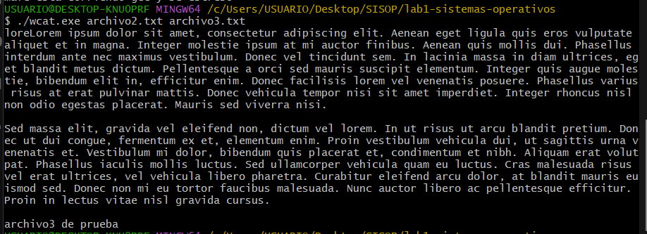
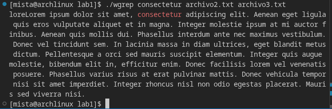
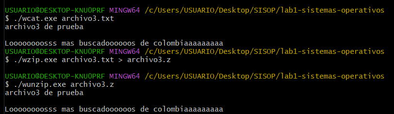

# **Laboratorio de Sistemas Operativos: Introducción al lenguaje C**

## **Práctica No. 1**

### **a) Integrantes:**

- Michael Stiven Tabares Tobón
Correo: michael.tabares@udea.edu.co
Cédula: 1036943803

- Maria Fernanda Atencia Oliva
Correo: mariaf.atencia@udea.edu.co
Cédula: 1064980223

### **b)  Documentación de todas las funciones desarrolladas en el código.**

- **Wcat**
    - *Descripción:* Esta función se encarga de leer el contenido de uno o más archivos pasados como argumentos en la línea de comandos y mostrarlo en la salida estándar (pantalla).
    - *Parámetros:* 
        - argc: número de argumentos recibidos por el programa desde la linea de comandos.
        - argv: arreglo de cadenas que contiene los argumentos pasados al programa, donde cada argumento es el nombre de un archivo a leer.
    - *Retorno:* Devuelve **0** si la función se ejecuta correctamente, o **1** si ocurre un error al abrir alguno de los archivos.
    - *Funcionamiento:* 
        1. Inicialmente, se verifica si se recibieron argumentos, en caso de que no (argc == 1) se termina el programa.
        2. Se itera sobre cada argumento (archivo) recibido, intentando abrirlo con la función `fopen`.
        3. Si el archivo no se puede abrir, se muestra un mensaje de error en la salida estándar de errores, se retorna **1** y finaliza.
        4. Si el archivo se abre correctamente, se lee su contenido línea por línea usando `fgets()` y se imprime en la salida estándar.
        5. Finalmente, se cierra el archivo con `fclose()` y se continúa con el siguiente archivo hasta procesar todos los argumentos.
- **Wgrep**
    - *Descripción:* Esta función busca una cadena específica dentro de uno o más archivos pasados como argumentos en la línea de comandos y muestra las líneas que contienen esa cadena.
    - *Parámetros:* 
        - argc: número de argumentos recibidos por el programa desde la linea de comandos.
        - argv: arreglo de cadenas que contiene los argumentos pasados al programa, donde el primer argumento (argv[1]) es la cadena a buscar y los siguientes (argv[2] en adelante) son los nombres de los archivos a revisar.
    - *Retorno:* Devuelve **0** si la función se ejecuta correctamente, o **1** si ocurre un error al abrir alguno de los archivos (por ejemplo, argumentos insuficientes o fallo al abrir un archivo).
    - *Funcionamiento:* 
        1. Se verifica que se hayan recibido suficientes argumentos (al menos dos), en caso contrario se termina el programa.
        2. El primer argumento (argv[1]) se guarda como la cadena a buscar.
        3. Se itera sobre cada archivo pasado como argumento (desde argv[2] hasta argv[argc-1]), intentando abrirlo con `fopen`.
        4. Si el archivo no se puede abrir, se muestra un mensaje de error en la salida estándar de errores, se retorna **1** y finaliza.
        5. Si el archivo se abre correctamente, se lee su contenido línea por línea usando `fgets()`, y para cada línea se verifica si contiene la cadena buscada utilizando `strstr()`.
        6. Si la línea contiene la cadena buscada, se imprime esa línea en la salida estándar.
        7. Finalmente, se cierra el archivo con `fclose()` y se continúa con el siguiente archivo hasta procesar todos los argumentos.
- **Wzip**
    - *Descripción:* Esta función comprime el contenido de uno o más archivos pasados como argumentos en la línea de comandos utilizando una técnica de compresión simple basada en la repetición de caracteres.
    - *Parámetros:* 
        - argc: número de argumentos recibidos por el programa desde la linea de comandos.
        - argv: arreglo de cadenas que contiene los argumentos pasados al programa, donde cada argumento es el nombre de un archivo a comprimir.
    - *Retorno:* Devuelve **0** si la función se ejecuta correctamente, o **1** si ocurre un error al abrir alguno de los archivos.
    - *Funcionamiento:* 
        1. Se verifica que se hayan recibido argumentos, en caso contrario se termina el programa.
        2. Inicializa variables:
            * prev: almacena el carácter anterior.
            * count: lleva el conteo de repeticiones consecutivas.
            * firstChar: indica si se está procesando el primer carácter.
        3. Se itera sobre cada archivo pasado como argumento, intentando abrirlo con `fopen`.
        4. Si el archivo no se puede abrir, se muestra un mensaje de error en la salida estándar de errores, se retorna **1** y finaliza.
        5. Si el archivo se abre correctamente, se lee su contenido carácter por carácter usando `fgetc()`, y se cuenta cuántas veces consecutivas aparece cada carácter.
        6. Para cada secuencia de caracteres repetidos, se escribe en la salida estándar el número de repeticiones seguido del carácter correspondiente (por ejemplo, "3a" para tres 'a' seguidas).
        7. Finalmente, se cierra el archivo con `fclose()` y se continúa con el siguiente archivo hasta procesar todos los argumentos.
- **Wunzip**
    - *Descripción:* Esta función descomprime el contenido generado por la función Wzip, leyendo una secuencia de caracteres comprimidos y expandiéndolos a su forma original.
    - *Parámetros:* 
        - argc: número de argumentos recibidos por el programa desde la linea de comandos.
        - argv: arreglo de cadenas que contiene los argumentos pasados al programa, donde cada argumento es el nombre de un archivo comprimido a descomprimir.
    - *Retorno:* Devuelve **0** si la función se ejecuta correctamente, o **1** si ocurre un error al abrir alguno de los archivos.
    - *Funcionamiento:* 
        1. Se verifica que se hayan recibido argumentos, en caso contrario se termina el programa.
        2. Se itera sobre cada archivo pasado como argumento, intentando abrirlo con `fopen`.
        3. Si el archivo no se puede abrir, se muestra un mensaje de error en la salida estándar de errores, se retorna **1** y finaliza.
        4. Si el archivo se abre correctamente, se lee su contenido carácter por carácter usando `fgetc()`, interpretando cada par de caracteres como un número (cantidad) seguido de un carácter (el carácter a repetir).
        5. Para cada par leído, se escribe en la salida estándar el carácter repetido la cantidad de veces indicada por el número (por ejemplo, "3a" se expandiría a "aaa").
        6. Finalmente, se cierra el archivo con `fclose()` y se continúa con el siguiente archivo hasta procesar todos los argumentos.

### **c) Problemas presentados durante el desarrollo de la práctica y sus soluciones**

- **Problema 1:** Uno de los inconvenientes presentados tuvo que ver mas que todo con el entorno de desarrollo para probar C, puesto que los programas utilizados para compilar estaban presentando muchos problemas en el computador con Windows.
- **Solución:** Para solucionar este problema se decidió utilizar un entorno software diferente, instalando MSYS2 y luego mingw64 para poder utilizar de forma eficiente el compilador de C gcc.
- **Problema 2:** Dado que anteriormente no se había trabajado nunca con C, entonces los conceptos de los argumentos argc y argv fueron difíciles de entender de primer mano.
- **Solución:** Se realizó una investigación exhaustiva sobre cómo funcionan los parámetros de línea de comandos en C, se estudiaron ejemplos prácticos y se implementaron pruebas iterativas con diferentes combinaciones de argumentos para consolidar el conocimiento.

### **d) Pruebas realizadas a los programas que verificaron su funcionalidad.**
- **Prueba de Wcat:**
    - Comando utilizado: './wcat.exe archivo2.txt archivo3.txt'
    - Resultado esperado: El contenido de ambos archivos se muestra en la salida estándar.
    - Resultado obtenido: El programa mostró correctamente el contenido de ambos archivos, confirmando que la función Wcat funciona como se esperaba.
    

- **Prueba de Wgrep:**
    - Comando utilizado: './wgrep.exe "cadena a buscar" archivo2.txt archivo3.txt'
    - Resultado esperado: Se muestran solo las líneas que contienen la cadena especificada.
    - Resultado obtenido: El programa filtró correctamente las líneas que contenían la cadena buscada, confirmando que la función Wgrep funciona como se esperaba.
    

- **Prueba de Wzip**
    - Comando utilizado: './wzip.exe archivo3.txt > archivo3.z'
    - Resultado esperado: Se genera un nuevo archivo comprimido con el contenido de archivo3.txt.
    - Resultado obtenido: El programa creó correctamente el archivo comprimido, confirmando que la función Wzip funciona como se esperaba.

- **Prueba de Wunzip**
    - Comando utilizado: './wunzip.exe archivo3.z'
    - Resultado esperado: Se genera un nuevo archivo descomprimido que coincide con el contenido original de archivo3.txt.
    - Resultado obtenido: El programa descomprimió correctamente el archivo, confirmando que la función Wunzip funciona como se esperaba.
    

### **e) Un enlace a un video de 10 minutos donde se sustente el desarrollo.**

Link de acceso al video: [Video de sustentación](https://drive.google.com/file/d/1GAcFqF3Qdxt98zFUUGepDu9RpPWUkwkF/view?usp=sharing)

### **f) Manifiesto de transparencia: En que puntos se apoyaron de la IA generativa.**

Nos apoyamos de ChatGPT para corregir la logica de la aplicación wzip, debido a que estaba siendo funcional pero no tan eficiente. 
De igual forma, hicimos uso de la IA para saber cómo resaltabamos de otro color la palabra a buscar en el método de wgrep, con el fin de que fuera más fácil identificar que la aplicación estaba siendo ejecutada correctamente.
